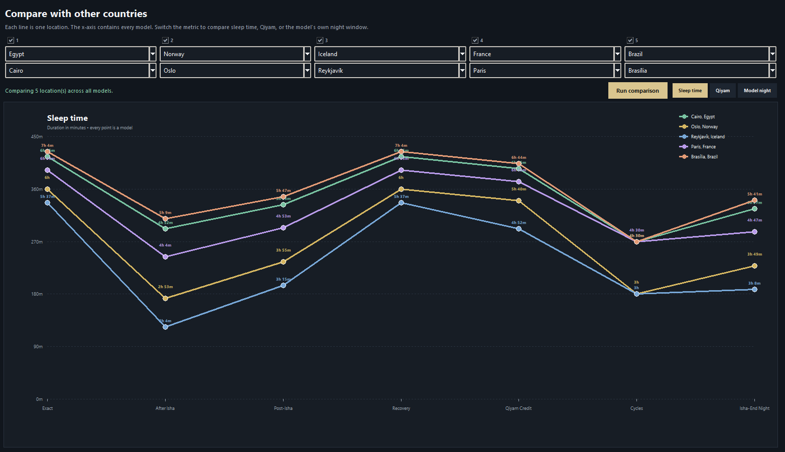
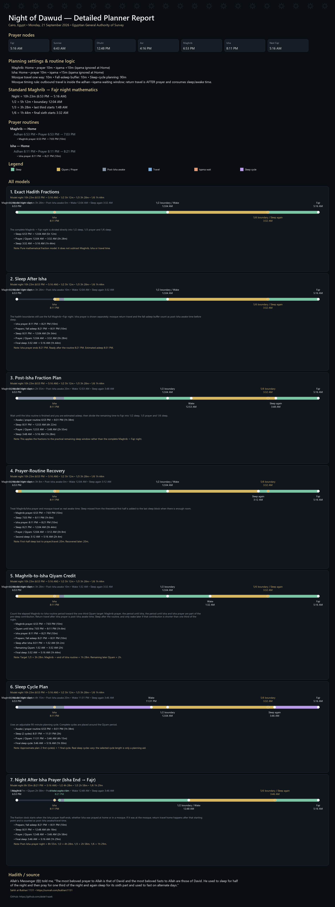

# Night of Dawud Planner

A desktop Python application for exploring night schedules based on
the hadith describing the prayer and sleep pattern of Prophet Dawud.

## Hadith

Allah's Messenger (ﷺ) told me, "The most beloved prayer to Allah is that of David and the most beloved fasts to Allah are those of David. He used to sleep for half of the night and then pray for one third of the night and again sleep for its sixth part and used to fast on alternate days."

Sahih al-Bukhari 1131:
https://sunnah.com/bukhari:1131

## Screenshots
Main Screen:


Compare with other countries:



Detailed Report Export:




## Features

- Fetch prayer times automatically
- Maghrib, Isha and next-day Fajr calculations
- 1/2, 1/3 and 1/6 night calculations
- Home and mosque prayer routines
- Iqama and mosque travel calculations
- Multiple sleep/Qiyam planning models
- Sleep-cycle model
- Custom Model Maker
- Country comparison graphs
- Prayer calculation methods
- Focused model view
- PNG report export
- Islamic-inspired dark UI
- Multi-month date selection

## Installation

Requires Python 3.11+.

```bash
pip install -r requirements.txt
```
## Use the app

```bash
python app.py
```
